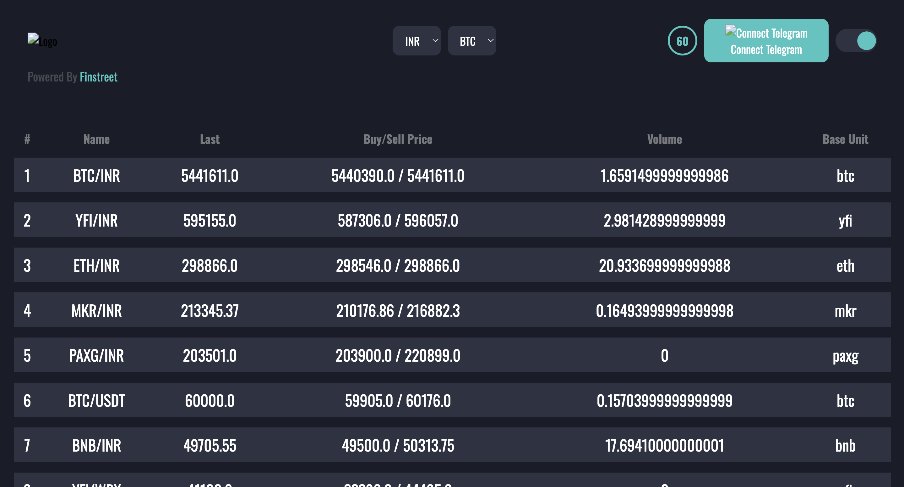
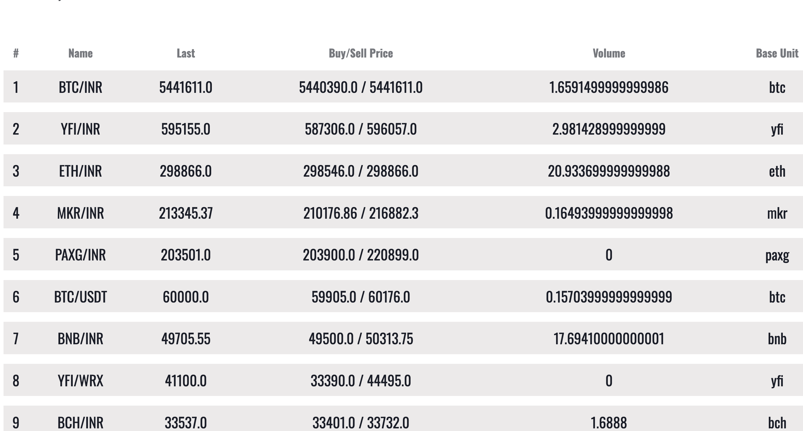

# HODLINFO-QuadBTech

The site is a cryptocurrency trading platform comparison tool that provides key information for different platforms, helping users make informed decisions.



## About

This project is a Node.js application that fetches data from an API, stores it in a database, and displays the processed data in a tabular view. It includes features like data retrieval, database storage, data processing, and frontend rendering using EJS templates.

You can access the live application here: [hodlinfo-quadbtech.onrender.com](https://hodlinfo-quadbtech.onrender.com/)

## Technologies Used

- HTML
- CSS
- EJS
- Axios

## Installation

1. Clone the repository:
    ```sh
    git clone https://Saurabhsing21/hodlinfo-task
    cd hodlinfo-quadbtech
    ```

2. Install dependencies using npm:
    ```sh
    npm install
    ```


3. Start the server:
    ```sh
    npm start
    ```

## Usage

1. Access the application on the provided URL (usually `http://localhost:3001` by default)
2. View the fetched data in a tabular format
3. Explore different functionalities and features

## Topics

- Node.js
- CSS
- HTML5

## Resources

- [Readme](./README.md)

## License

This project is licensed under the Apache-2.0 License. See the [LICENSE](./LICENSE) file for details.

## Activity

- Stars: 1 star
- Watchers: 1 watching
- Forks: 0 forks

## Report repository

For any issues, please open an issue in this repository.

## Releases

No releases published.

## Packages

No packages published.

## Languages

- EJS: 44.1%
- CSS: 31.7%
- JavaScript: 24.2%

---

© 2024 GitHub, Inc.
